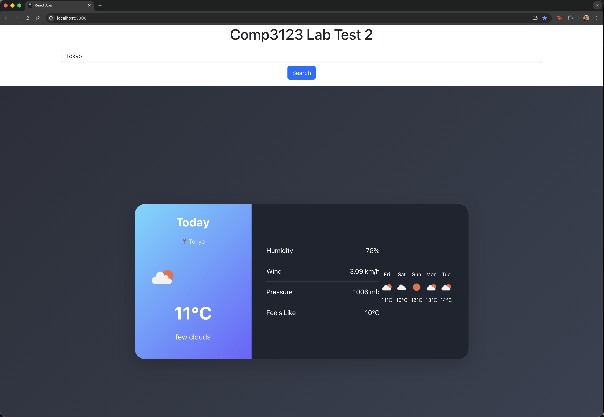
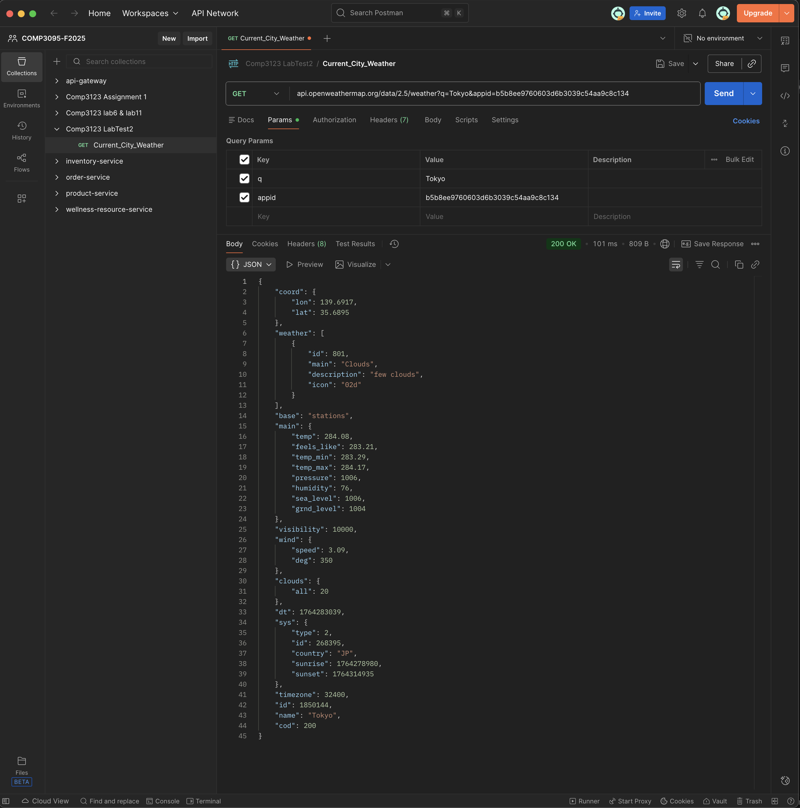

# COMP3123 Weather App

This is a React-based Weather Application developed for COMP3123 Lab Test 2.  
The application allows users to search for any city and view real-time weather data using the OpenWeatherMap API.

---

## Technologies Used
- React
- Axios
- Bootstrap
- OpenWeatherMap API

---

## Features
- Search weather by city
- Display real-time temperature
- Show weather condition with dynamic icons
- Display humidity, wind speed, pressure, and feels-like temperature
- 5-day mini forecast display
- Responsive and modern UI design

---

## Setup Instructions

1. Clone the repository
2. Install dependencies:
   ```bash
   npm install
3. npm start
4. http://localhost:3000

## Screenshots & Output Description

### City Search Feature
This screen demonstrates searching weather by city name.



### API Response in Postman
This shows the API response used to fetch weather data.


